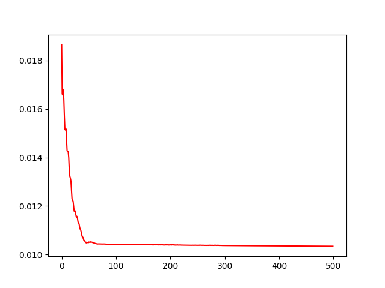

# Financial Modeling: Incorporate Economic Indicators with Deep Learning

Current approaches in predicting the market and stock prices are predominantly dependent on the historical data of stock prices.
Since the market operates according to the relationship of a variety of factors, current approaches are incapable of creating accurate and robust financial models.

By incorporating economic indicators (moving average on stock/gold, beta sensitivity, macro-volatility w/ VIX)
with artificial intelligence (Deep Neural Network), we can supplement current limitations of quantitative finance
by using those robust variables to evaluate the performance of various stocks (i.e., potential profit range over the course of 6M+).

# How it works
---------------------------------------------------------------------------------------------------------------------------------------

---------------------------------------------------------------------------------------------------------------------------------------

## Pre-requisite

Install required packages before testing:

- tensorflow
- numpy
- matplotlib
- tqdm
- prettytable

~~~~~~~~~~
pip3 install -r ./res/requirements.txt
~~~~~~~~~~

## Model Training

**Steps**:
- Write a file containing a list of stocks in "**index**" directory
- In ***train.py*** change the path inserted in ***GetIndexList***
- In ***train.py*** change the model name inserted in ***FinancialModel***

~~~~~~~~~~
./train.py
~~~~~~~~~~

**Model Specs**:
- *Default Model Dimension*: 3 Layers [[input, input.size],[input.size,input.size],[input.size,1]] --> change this in core.core.py
- *Model Type*: tf.train.AdamOptimizer(learning_rate=0.01)
- *Model MSE*: 0.013

## Model Testing

Follow the exact same steps as when training:

~~~~~~~~~~
./run.py
~~~~~~~~~~

